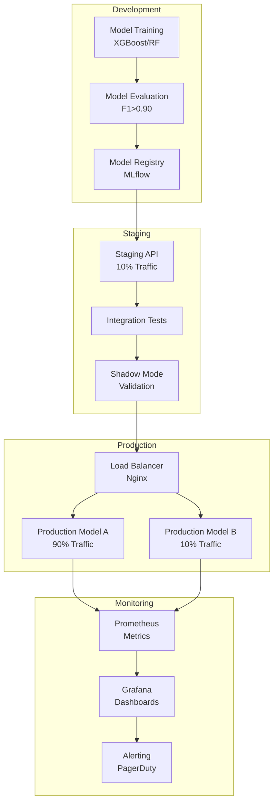

# MODEL DEPLOYMENT GUIDE

Comprehensive MLOps guide for deploying machine learning models for aviation accident prediction. Covers versioning, A/B testing, monitoring, drift detection, and production best practices.

## Table of Contents

- [Introduction to ML Model Deployment](#introduction-to-ml-model-deployment)
- [Model Versioning Strategies](#model-versioning-strategies)
- [A/B Testing Framework](#ab-testing-framework)
- [Data Drift Detection](#data-drift-detection)
- [Model Monitoring Dashboard](#model-monitoring-dashboard)
- [Rollback Strategies](#rollback-strategies)
- [Canary Deployments](#canary-deployments)
- [Model Explainability in Production](#model-explainability-in-production)
- [Batch vs Real-Time Inference](#batch-vs-real-time-inference)
- [Security and Validation](#security-and-validation)
- [Production Deployment Checklist](#production-deployment-checklist)

## Introduction to ML Model Deployment

### MLOps Fundamentals

**MLOps** (Machine Learning Operations) extends DevOps principles to machine learning systems, ensuring reliable, scalable, and maintainable ML model deployment.

**Key Challenges in Aviation ML Deployment:**
- **Data drift**: NTSB data evolves (new aircraft types, changing regulations, emerging failure modes)
- **Concept drift**: Relationships between features and severity change over time
- **Model staleness**: Models trained on historical data may degrade on recent accidents
- **Explainability requirements**: Regulatory and safety-critical applications demand interpretability
- **Low-latency inference**: Real-time risk assessment requires <1s predictions
- **High availability**: Aviation safety systems need 99.9%+ uptime

### Deployment Architecture



## Model Versioning Strategies

### Semantic Versioning for ML Models

Use semantic versioning (`MAJOR.MINOR.PATCH`) to track model evolution:

```
Model version: X.Y.Z

X (Major): Breaking changes (new architecture, different features)
Y (Minor): Non-breaking improvements (hyperparameter tuning, retraining)
Z (Patch): Bug fixes, metadata updates

Examples:
- severity_predictor_v2.3.1
- occurrence_classifier_v1.5.0
- risk_scorer_v3.0.0
```

### MLflow Model Registry

```python
import mlflow
from mlflow.tracking import MlflowClient

# Register model after training
def register_model(run_id, model_name, version_metadata):
    """
    Register trained model in MLflow registry.

    Args:
        run_id: MLflow run ID from training
        model_name: Model name (e.g., "severity_predictor")
        version_metadata: Dict with training details
    """

    # Register model from run
    model_uri = f"runs:/{run_id}/model"
    model_details = mlflow.register_model(model_uri, model_name)

    # Add metadata
    client = MlflowClient()
    client.set_model_version_tag(
        name=model_name,
        version=model_details.version,
        key="training_dataset_size",
        value=str(version_metadata['dataset_size'])
    )
    client.set_model_version_tag(
        name=model_name,
        version=model_details.version,
        key="f1_score",
        value=str(version_metadata['f1_score'])
    )
    client.set_model_version_tag(
        name=model_name,
        version=model_details.version,
        key="feature_count",
        value=str(version_metadata['feature_count'])
    )

    print(f"Registered {model_name} version {model_details.version}")

    return model_details

# Transition model to production
def promote_to_production(model_name, version):
    """
    Promote model version to production stage.
    """
    client = MlflowClient()

    # Archive current production models
    production_models = client.get_latest_versions(model_name, stages=["Production"])
    for prod_model in production_models:
        client.transition_model_version_stage(
            name=model_name,
            version=prod_model.version,
            stage="Archived"
        )

    # Promote new version
    client.transition_model_version_stage(
        name=model_name,
        version=version,
        stage="Production"
    )

    print(f"Promoted {model_name} v{version} to Production")

# Load production model
def load_production_model(model_name):
    """
    Load current production model.
    """
    model_uri = f"models:/{model_name}/Production"
    model = mlflow.pyfunc.load_model(model_uri)

    return model

# Usage example
metadata = {
    'dataset_size': 50000,
    'f1_score': 0.912,
    'feature_count': 145,
    'training_date': '2025-01-15'
}

model_details = register_model(run_id="abc123", model_name="severity_predictor", version_metadata=metadata)
promote_to_production("severity_predictor", model_details.version)
```

### Version Comparison

```python
def compare_model_versions(model_name, version_a, version_b, test_data):
    """
    Compare performance of two model versions.
    """
    from sklearn.metrics import f1_score, accuracy_score, classification_report

    # Load models
    model_a = mlflow.pyfunc.load_model(f"models:/{model_name}/{version_a}")
    model_b = mlflow.pyfunc.load_model(f"models:/{model_name}/{version_b}")

    X_test, y_test = test_data

    # Predictions
    y_pred_a = model_a.predict(X_test)
    y_pred_b = model_b.predict(X_test)

    # Metrics
    results = pd.DataFrame({
        'metric': ['Accuracy', 'F1 (weighted)', 'F1 (macro)'],
        f'v{version_a}': [
            accuracy_score(y_test, y_pred_a),
            f1_score(y_test, y_pred_a, average='weighted'),
            f1_score(y_test, y_pred_a, average='macro')
        ],
        f'v{version_b}': [
            accuracy_score(y_test, y_pred_b),
            f1_score(y_test, y_pred_b, average='weighted'),
            f1_score(y_test, y_pred_b, average='macro')
        ]
    })

    results['improvement'] = results[f'v{version_b}'] - results[f'v{version_a}']
    results['improvement_pct'] = (results['improvement'] / results[f'v{version_a}']) * 100

    print(results)

    # Statistical significance test
    from scipy.stats import mcnemar

    # McNemar's test for paired predictions
    contingency_table = pd.crosstab(y_pred_a == y_test, y_pred_b == y_test)
    result = mcnemar(contingency_table, exact=False, correction=True)

    print(f"\nMcNemar's test p-value: {result.pvalue:.4f}")
    if result.pvalue < 0.05:
        print("Performance difference is statistically significant!")

    return results
```

## A/B Testing Framework

### Traffic Splitting Router

```python
import hashlib
from typing import Tuple

class ModelRouter:
    """
    Route traffic between model versions for A/B testing.
    """

    def __init__(self, model_a_name: str, model_b_name: str, traffic_split: float = 0.90):
        """
        Args:
            model_a_name: Name/path of model A (baseline)
            model_b_name: Name/path of model B (candidate)
            traffic_split: Fraction of traffic to model A (default 0.90 = 90% A, 10% B)
        """
        self.model_a = mlflow.pyfunc.load_model(model_a_name)
        self.model_b = mlflow.pyfunc.load_model(model_b_name)
        self.traffic_split = traffic_split

    def route(self, user_id: str, features) -> Tuple[any, str]:
        """
        Route prediction request to model A or B based on user_id hash.

        Ensures consistent routing (same user always gets same model).
        """
        # Hash user_id to deterministic value
        hash_value = int(hashlib.md5(user_id.encode()).hexdigest(), 16)
        route_to_a = (hash_value % 100) < (self.traffic_split * 100)

        if route_to_a:
            prediction = self.model_a.predict(features)
            model_version = 'model_a'
        else:
            prediction = self.model_b.predict(features)
            model_version = 'model_b'

        return prediction, model_version

    def predict_with_logging(self, user_id: str, features, ev_id: str = None):
        """
        Predict and log for A/B analysis.
        """
        import time

        start_time = time.time()
        prediction, model_version = self.route(user_id, features)
        latency = time.time() - start_time

        # Log prediction for analysis
        log_prediction({
            'ev_id': ev_id,
            'user_id': user_id,
            'model_version': model_version,
            'prediction': prediction[0] if hasattr(prediction, '__len__') else prediction,
            'latency_ms': latency * 1000,
            'timestamp': time.time()
        })

        return prediction, model_version

# Prediction logging
prediction_logs = []

def log_prediction(log_entry):
    """Store prediction for A/B analysis."""
    prediction_logs.append(log_entry)
    # In production: Write to database or Kafka stream
```

### A/B Test Analysis

```python
def analyze_ab_test(logs_df, metric='f1_score', alpha=0.05):
    """
    Analyze A/B test results for statistical significance.

    Args:
        logs_df: DataFrame with columns ['model_version', 'prediction', 'actual', 'latency_ms']
        metric: Metric to compare ('f1_score', 'accuracy', 'latency')
        alpha: Significance level (default 0.05)
    """
    from scipy.stats import ttest_ind
    from sklearn.metrics import f1_score, accuracy_score

    # Split by model version
    model_a_logs = logs_df[logs_df['model_version'] == 'model_a']
    model_b_logs = logs_df[logs_df['model_version'] == 'model_b']

    print(f"Model A: {len(model_a_logs)} predictions")
    print(f"Model B: {len(model_b_logs)} predictions")

    # Compute metrics
    if metric == 'f1_score':
        metric_a = f1_score(model_a_logs['actual'], model_a_logs['prediction'], average='weighted')
        metric_b = f1_score(model_b_logs['actual'], model_b_logs['prediction'], average='weighted')
    elif metric == 'accuracy':
        metric_a = accuracy_score(model_a_logs['actual'], model_a_logs['prediction'])
        metric_b = accuracy_score(model_b_logs['actual'], model_b_logs['prediction'])
    elif metric == 'latency':
        metric_a = model_a_logs['latency_ms'].mean()
        metric_b = model_b_logs['latency_ms'].mean()
    else:
        raise ValueError(f"Unknown metric: {metric}")

    print(f"\nModel A {metric}: {metric_a:.4f}")
    print(f"Model B {metric}: {metric_b:.4f}")
    print(f"Improvement: {((metric_b - metric_a) / metric_a * 100):.2f}%")

    # Statistical significance (t-test)
    # For latency
    if metric == 'latency':
        t_stat, p_value = ttest_ind(model_a_logs['latency_ms'], model_b_logs['latency_ms'])
    else:
        # For classification metrics, use bootstrap
        from scipy.stats import bootstrap
        # Simplified: Use prediction correctness as samples
        correct_a = (model_a_logs['prediction'] == model_a_logs['actual']).astype(int)
        correct_b = (model_b_logs['prediction'] == model_b_logs['actual']).astype(int)
        t_stat, p_value = ttest_ind(correct_a, correct_b)

    print(f"\nT-statistic: {t_stat:.4f}")
    print(f"P-value: {p_value:.4f}")

    if p_value < alpha:
        print(f"✅ Difference is statistically significant at α={alpha}")
        if metric_b > metric_a:
            print("   → Model B is significantly better. Recommend full rollout.")
        else:
            print("   → Model A is significantly better. Keep current model.")
    else:
        print(f"❌ Difference is NOT statistically significant at α={alpha}")
        print("   → Continue A/B test or investigate further.")

    return {
        'metric_a': metric_a,
        'metric_b': metric_b,
        'p_value': p_value,
        'significant': p_value < alpha
    }
```

## Data Drift Detection

### Feature Distribution Drift

```python
from evidently.report import Report
from evidently.metric_preset import DataDriftPreset, DataQualityPreset

def detect_data_drift(reference_data, current_data, drift_threshold=0.1):
    """
    Detect statistical drift in feature distributions.

    Uses Evidently AI for comprehensive drift detection.

    Args:
        reference_data: Historical data (training set)
        current_data: Recent production data
        drift_threshold: Drift score threshold (0-1)
    """

    # Create drift report
    report = Report(metrics=[
        DataDriftPreset(drift_share=drift_threshold),
        DataQualityPreset()
    ])

    report.run(reference_data=reference_data, current_data=current_data)

    # Extract drift results
    drift_results = report.as_dict()

    # Check for dataset-level drift
    dataset_drift = drift_results['metrics'][0]['result']['dataset_drift']

    if dataset_drift:
        print("⚠️ DATASET DRIFT DETECTED!")

        # Identify drifted features
        drifted_features = []
        for feature, stats in drift_results['metrics'][0]['result']['drift_by_columns'].items():
            if stats['drift_detected']:
                drifted_features.append({
                    'feature': feature,
                    'drift_score': stats['drift_score'],
                    'stattest': stats['stattest_name']
                })

        drifted_df = pd.DataFrame(drifted_features).sort_values('drift_score', ascending=False)
        print(f"\n{len(drifted_features)} features with significant drift:")
        print(drifted_df.head(10))

        # Alert for retraining
        send_alert(
            title="Data Drift Detected",
            message=f"{len(drifted_features)} features drifted. Consider model retraining.",
            severity="warning"
        )

        return True, drifted_features

    else:
        print("✅ No significant data drift detected.")
        return False, []

# Example usage
reference = df_train[feature_columns]  # Training data
current = df_production_recent[feature_columns]  # Last 30 days of production

drift_detected, drifted_features = detect_data_drift(reference, current)
```

### Concept Drift Detection

```python
def detect_concept_drift(model, validation_data_historical, validation_data_recent,
                         performance_threshold=0.05):
    """
    Detect concept drift by comparing model performance over time.

    Args:
        model: Trained model
        validation_data_historical: Validation set from training time
        validation_data_recent: Recent validation data (last 30-90 days)
        performance_threshold: Acceptable performance drop (default 5%)
    """
    from sklearn.metrics import f1_score

    X_hist, y_hist = validation_data_historical
    X_recent, y_recent = validation_data_recent

    # Evaluate on historical data
    y_pred_hist = model.predict(X_hist)
    f1_hist = f1_score(y_hist, y_pred_hist, average='weighted')

    # Evaluate on recent data
    y_pred_recent = model.predict(X_recent)
    f1_recent = f1_score(y_recent, y_pred_recent, average='weighted')

    # Performance drop
    performance_drop = f1_hist - f1_recent
    drop_pct = (performance_drop / f1_hist) * 100

    print(f"Historical F1: {f1_hist:.4f}")
    print(f"Recent F1:     {f1_recent:.4f}")
    print(f"Drop:          {performance_drop:.4f} ({drop_pct:.2f}%)")

    if performance_drop > performance_threshold:
        print(f"⚠️ CONCEPT DRIFT DETECTED! Performance dropped by {drop_pct:.2f}%")

        send_alert(
            title="Concept Drift Detected",
            message=f"Model F1 score dropped from {f1_hist:.3f} to {f1_recent:.3f}. Retrain recommended.",
            severity="critical"
        )

        return True, performance_drop

    else:
        print("✅ No significant concept drift.")
        return False, performance_drop

def send_alert(title, message, severity="info"):
    """Send alert to monitoring system."""
    # Implementation: PagerDuty, Slack, email, etc.
    print(f"[{severity.upper()}] {title}: {message}")
```

## Model Monitoring Dashboard

### Prometheus Metrics

```python
from prometheus_client import Counter, Histogram, Gauge, start_http_server

# Define metrics
prediction_counter = Counter(
    'aviation_model_predictions_total',
    'Total predictions made',
    ['model_version', 'severity_class']
)

prediction_latency = Histogram(
    'aviation_model_prediction_latency_seconds',
    'Prediction latency in seconds',
    ['model_version'],
    buckets=[0.001, 0.01, 0.1, 0.5, 1.0, 2.0, 5.0]
)

model_accuracy = Gauge(
    'aviation_model_accuracy',
    'Current model accuracy on validation set',
    ['model_version']
)

data_drift_score = Gauge(
    'aviation_data_drift_score',
    'Data drift score (0-1)',
    ['feature_name']
)

# FastAPI endpoint with metrics
from fastapi import FastAPI, HTTPException
import time

app = FastAPI()

@app.post("/predict")
async def predict(request: dict):
    """
    Prediction endpoint with Prometheus metrics.
    """
    start_time = time.time()

    try:
        # Load model
        model = load_production_model("severity_predictor")

        # Extract features
        features = pd.DataFrame([request['features']])

        # Predict
        prediction = model.predict(features)[0]
        probabilities = model.predict_proba(features)[0] if hasattr(model, 'predict_proba') else None

        # Record metrics
        prediction_counter.labels(
            model_version='v2.3.1',
            severity_class=prediction
        ).inc()

        latency = time.time() - start_time
        prediction_latency.labels(model_version='v2.3.1').observe(latency)

        return {
            'prediction': int(prediction),
            'probabilities': probabilities.tolist() if probabilities is not None else None,
            'latency_seconds': latency,
            'model_version': 'v2.3.1'
        }

    except Exception as e:
        raise HTTPException(status_code=500, detail=str(e))

# Start Prometheus metrics server
start_http_server(8000)  # Metrics at http://localhost:8000/metrics
```

### Grafana Dashboard Configuration

```yaml
# grafana_dashboard.json (excerpt)
{
  "dashboard": {
    "title": "Aviation ML Model Monitoring",
    "panels": [
      {
        "title": "Predictions per Minute",
        "targets": [{
          "expr": "rate(aviation_model_predictions_total[1m])"
        }],
        "type": "graph"
      },
      {
        "title": "Prediction Latency (p95)",
        "targets": [{
          "expr": "histogram_quantile(0.95, rate(aviation_model_prediction_latency_seconds_bucket[5m]))"
        }],
        "type": "graph"
      },
      {
        "title": "Model Accuracy Over Time",
        "targets": [{
          "expr": "aviation_model_accuracy"
        }],
        "type": "graph",
        "alert": {
          "conditions": [{
            "type": "query",
            "query": "A",
            "reducer": {"type": "avg"},
            "evaluator": {"type": "lt", "params": [0.85]}
          }],
          "frequency": "1m",
          "message": "Model accuracy dropped below 85%!"
        }
      },
      {
        "title": "Data Drift Score by Feature",
        "targets": [{
          "expr": "aviation_data_drift_score"
        }],
        "type": "heatmap"
      }
    ]
  }
}
```

## Rollback Strategies

### Automated Rollback

```python
class ModelDeploymentManager:
    """
    Manage model deployments with automatic rollback on failures.
    """

    def __init__(self, model_registry_uri):
        self.client = MlflowClient(model_registry_uri)
        self.previous_production = None

    def deploy_with_safety(self, model_name, new_version, validation_func=None):
        """
        Deploy new model version with safety checks and automatic rollback.

        Args:
            model_name: Name of model
            new_version: Version to deploy
            validation_func: Optional validation function (returns True if healthy)
        """

        # 1. Store current production model
        print("Step 1: Backing up current production model...")
        self.previous_production = self._get_production_version(model_name)

        # 2. Deploy to staging
        print(f"Step 2: Deploying v{new_version} to staging...")
        self._transition_stage(model_name, new_version, "Staging")

        # 3. Run smoke tests
        print("Step 3: Running smoke tests...")
        if not self._run_smoke_tests(model_name, new_version):
            print("❌ Smoke tests failed. Aborting deployment.")
            return False

        # 4. Canary deployment (10% traffic)
        print("Step 4: Canary deployment (10% traffic)...")
        self._set_traffic_split(model_name, new_version, traffic_fraction=0.10)

        # 5. Monitor for 1 hour
        print("Step 5: Monitoring canary for 1 hour...")
        time.sleep(3600)  # In production: continuous monitoring

        # 6. Validate canary performance
        if validation_func and not validation_func(model_name, new_version):
            print("❌ Canary validation failed. Rolling back...")
            self.rollback(model_name)
            return False

        # 7. Gradual rollout: 50%
        print("Step 6: Increasing traffic to 50%...")
        self._set_traffic_split(model_name, new_version, traffic_fraction=0.50)
        time.sleep(1800)  # Monitor for 30 mins

        # 8. Final validation
        if validation_func and not validation_func(model_name, new_version):
            print("❌ 50% rollout validation failed. Rolling back...")
            self.rollback(model_name)
            return False

        # 9. Full rollout
        print("Step 7: Full rollout (100% traffic)...")
        self._promote_to_production(model_name, new_version)

        print(f"✅ Successfully deployed {model_name} v{new_version} to production!")
        return True

    def rollback(self, model_name):
        """
        Immediate rollback to previous production version.
        """
        if self.previous_production is None:
            print("⚠️ No previous production version to rollback to!")
            return False

        print(f"🔄 Rolling back to v{self.previous_production}...")

        # Transition previous version back to production
        self._promote_to_production(model_name, self.previous_production)

        # Alert
        send_alert(
            title="Model Rollback Executed",
            message=f"{model_name} rolled back to v{self.previous_production}",
            severity="critical"
        )

        print(f"✅ Rollback complete. {model_name} v{self.previous_production} is now in production.")
        return True

    def _run_smoke_tests(self, model_name, version):
        """Run basic validation tests."""
        # Load model
        model = mlflow.pyfunc.load_model(f"models:/{model_name}/{version}")

        # Test predictions on sample data
        try:
            sample_data = get_test_samples(n=100)
            predictions = model.predict(sample_data)

            # Validate prediction shape and types
            assert predictions.shape[0] == 100, "Prediction count mismatch"
            assert predictions.dtype in [np.int32, np.int64], "Invalid prediction type"

            return True

        except Exception as e:
            print(f"Smoke test failed: {e}")
            return False

    def _get_production_version(self, model_name):
        """Get current production version."""
        versions = self.client.get_latest_versions(model_name, stages=["Production"])
        return versions[0].version if versions else None

    def _promote_to_production(self, model_name, version):
        """Promote version to production."""
        self.client.transition_model_version_stage(
            name=model_name,
            version=version,
            stage="Production"
        )
```

## Canary Deployments

### Kubernetes Deployment Configuration

```yaml
# canary-deployment.yaml
apiVersion: apps/v1
kind: Deployment
metadata:
  name: aviation-model-canary
  labels:
    app: aviation-model
    version: canary
spec:
  replicas: 1  # Small canary
  selector:
    matchLabels:
      app: aviation-model
      version: canary
  template:
    metadata:
      labels:
        app: aviation-model
        version: canary
    spec:
      containers:
      - name: model-server
        image: aviation-model:v2.4.0
        ports:
        - containerPort: 8080
        resources:
          requests:
            memory: "2Gi"
            cpu: "1000m"
          limits:
            memory: "4Gi"
            cpu: "2000m"
        livenessProbe:
          httpGet:
            path: /health
            port: 8080
          initialDelaySeconds: 30
          periodSeconds: 10
        readinessProbe:
          httpGet:
            path: /ready
            port: 8080
          initialDelaySeconds: 5
          periodSeconds: 5

---
apiVersion: apps/v1
kind: Deployment
metadata:
  name: aviation-model-stable
  labels:
    app: aviation-model
    version: stable
spec:
  replicas: 9  # Main production traffic
  selector:
    matchLabels:
      app: aviation-model
      version: stable
  template:
    metadata:
      labels:
        app: aviation-model
        version: stable
    spec:
      containers:
      - name: model-server
        image: aviation-model:v2.3.1
        # ... (similar configuration)

---
# Service (load balances across canary + stable)
apiVersion: v1
kind: Service
metadata:
  name: aviation-model-service
spec:
  selector:
    app: aviation-model
  ports:
  - protocol: TCP
    port: 80
    targetPort: 8080
  type: LoadBalancer
```

### Istio Traffic Splitting

```yaml
# istio-virtual-service.yaml
apiVersion: networking.istio.io/v1alpha3
kind: VirtualService
metadata:
  name: aviation-model-vs
spec:
  hosts:
  - aviation-model-service
  http:
  - match:
    - headers:
        x-canary:
          exact: "true"
    route:
    - destination:
        host: aviation-model-service
        subset: canary
  - route:
    - destination:
        host: aviation-model-service
        subset: stable
      weight: 90
    - destination:
        host: aviation-model-service
        subset: canary
      weight: 10
```

## Model Explainability in Production

### Real-Time SHAP Explanations

```python
import shap

class ExplainableModelServer:
    """
    Model server with built-in explanations for production.
    """

    def __init__(self, model_path):
        self.model = mlflow.pyfunc.load_model(model_path)
        self.explainer = shap.TreeExplainer(self.model._model_impl.python_model)

    def predict_with_explanation(self, features, top_k=5):
        """
        Return prediction with top-K contributing features.

        Args:
            features: DataFrame with feature values
            top_k: Number of top features to return

        Returns:
            Dict with prediction, probabilities, and explanations
        """

        # Prediction
        prediction = self.model.predict(features)[0]
        probabilities = self.model.predict_proba(features)[0] if hasattr(self.model, 'predict_proba') else None

        # SHAP values
        shap_values = self.explainer.shap_values(features)

        # Handle multi-class (take SHAP for predicted class)
        if isinstance(shap_values, list):
            shap_for_prediction = shap_values[prediction]
        else:
            shap_for_prediction = shap_values

        # Top contributing features
        feature_impacts = pd.DataFrame({
            'feature': features.columns,
            'value': features.iloc[0].values,
            'shap_value': shap_for_prediction[0]
        })
        feature_impacts['abs_impact'] = feature_impacts['shap_value'].abs()
        top_features = feature_impacts.nlargest(top_k, 'abs_impact')

        return {
            'prediction': int(prediction),
            'prediction_label': ['Fatal', 'Serious', 'Minor', 'None'][prediction],
            'probabilities': {
                'Fatal': float(probabilities[0]),
                'Serious': float(probabilities[1]),
                'Minor': float(probabilities[2]),
                'None': float(probabilities[3])
            } if probabilities is not None else None,
            'top_contributing_factors': [
                {
                    'feature': row['feature'],
                    'value': row['value'],
                    'impact': float(row['shap_value']),
                    'impact_direction': 'increases' if row['shap_value'] > 0 else 'decreases'
                }
                for _, row in top_features.iterrows()
            ]
        }

# FastAPI endpoint with explanations
@app.post("/predict/explain")
async def predict_with_explanation(request: dict):
    """
    Prediction endpoint with SHAP explanations.
    """
    features = pd.DataFrame([request['features']])

    result = explainer_server.predict_with_explanation(features, top_k=5)

    return result
```

## Batch vs Real-Time Inference

### Batch Prediction Pipeline (Airflow)

```python
# dags/batch_predictions.py
from airflow import DAG
from airflow.operators.python import PythonOperator
from datetime import datetime, timedelta

def batch_predict_task():
    """
    Generate predictions for recent accidents (last 30 days).
    """
    import mlflow
    import pandas as pd

    # Load production model
    model = mlflow.pyfunc.load_model("models:/severity_predictor/Production")

    # Load recent accidents (no labels yet)
    df = load_recent_accidents(days=30)

    # Feature engineering
    features = prepare_features(df)

    # Batch predict (efficient)
    predictions = model.predict(features)
    probabilities = model.predict_proba(features) if hasattr(model, 'predict_proba') else None

    # Store results
    results = pd.DataFrame({
        'ev_id': df['ev_id'],
        'predicted_severity': predictions,
        'prob_fatal': probabilities[:, 0] if probabilities is not None else None,
        'prob_serious': probabilities[:, 1] if probabilities is not None else None,
        'prob_minor': probabilities[:, 2] if probabilities is not None else None,
        'prob_none': probabilities[:, 3] if probabilities is not None else None,
        'prediction_date': datetime.now()
    })

    # Write to database
    results.to_sql('predictions', engine, if_exists='append', index=False)

    print(f"Batch predictions complete: {len(results)} accidents processed")

# Define DAG
default_args = {
    'owner': 'aviation_ml',
    'depends_on_past': False,
    'email_on_failure': True,
    'email': ['alerts@aviation-ml.com'],
    'retries': 2,
    'retry_delay': timedelta(minutes=5)
}

dag = DAG(
    'batch_accident_predictions',
    default_args=default_args,
    description='Daily batch predictions for recent accidents',
    schedule_interval='@daily',
    start_date=datetime(2025, 1, 1),
    catchup=False
)

predict_task = PythonOperator(
    task_id='batch_predict',
    python_callable=batch_predict_task,
    dag=dag
)
```

### Real-Time Inference API

```python
# Real-time FastAPI server
from fastapi import FastAPI, Request
from pydantic import BaseModel
import asyncio

app = FastAPI()

class PredictionRequest(BaseModel):
    ev_id: str
    features: dict

# Model cache (load once, reuse)
MODEL_CACHE = {}

async def get_cached_model(model_name="severity_predictor"):
    """Load model once and cache."""
    if model_name not in MODEL_CACHE:
        MODEL_CACHE[model_name] = mlflow.pyfunc.load_model(f"models:/{model_name}/Production")
    return MODEL_CACHE[model_name]

@app.post("/predict/realtime")
async def predict_realtime(request: PredictionRequest):
    """
    Real-time prediction endpoint with <1s latency.
    """
    start_time = time.time()

    # Get cached model
    model = await get_cached_model()

    # Prepare features
    features_df = pd.DataFrame([request.features])

    # Predict
    prediction = model.predict(features_df)[0]
    probabilities = model.predict_proba(features_df)[0] if hasattr(model, 'predict_proba') else None

    latency = time.time() - start_time

    return {
        'ev_id': request.ev_id,
        'prediction': int(prediction),
        'prediction_label': ['Fatal', 'Serious', 'Minor', 'None'][prediction],
        'probabilities': probabilities.tolist() if probabilities is not None else None,
        'latency_seconds': latency,
        'timestamp': datetime.now().isoformat()
    }

# Run with: uvicorn main:app --workers 4 --host 0.0.0.0 --port 8000
```

## Security and Validation

### Input Validation

```python
from pydantic import BaseModel, validator, Field

class AviationFeatures(BaseModel):
    """
    Validated input schema for aviation predictions.
    """
    aircraft_age: int = Field(..., ge=0, le=100, description="Aircraft age in years")
    pilot_tot_time: float = Field(..., ge=0, le=50000, description="Pilot total hours")
    pilot_90_days: float = Field(..., ge=0, le=500, description="Hours in last 90 days")
    dec_latitude: float = Field(..., ge=-90, le=90, description="Latitude")
    dec_longitude: float = Field(..., ge=-180, le=180, description="Longitude")
    phase_code: int = Field(..., ge=500, le=620, description="Phase of operation code")
    occurrence_code: int = Field(..., ge=100, le=430, description="Occurrence code")

    @validator('pilot_90_days')
    def validate_recent_hours(cls, v, values):
        """Recent hours cannot exceed total hours."""
        if 'pilot_tot_time' in values and v > values['pilot_tot_time']:
            raise ValueError('pilot_90_days cannot exceed pilot_tot_time')
        return v

    @validator('occurrence_code')
    def validate_occurrence_code(cls, v):
        """Validate occurrence code is in valid range."""
        valid_ranges = [(100, 179), (200, 259), (260, 290), (300, 370), (380, 390), (400, 430)]
        if not any(start <= v <= end for start, end in valid_ranges):
            raise ValueError(f'Invalid occurrence code: {v}')
        return v

@app.post("/predict")
async def predict(features: AviationFeatures):
    """Endpoint with automatic validation."""
    # Pydantic automatically validates input
    features_dict = features.dict()

    # ... prediction logic
```

## Production Deployment Checklist

### Pre-Deployment

- [ ] Model trained and validated (F1 > target threshold)
- [ ] Feature engineering pipeline tested on production-like data
- [ ] Model registered in MLflow registry with metadata
- [ ] API endpoints tested locally with mock data
- [ ] Load testing completed (1000+ req/s sustained)
- [ ] Monitoring dashboards created (Grafana)
- [ ] Rollback procedure documented and tested
- [ ] Security review completed (input validation, authentication)

### During Deployment

- [ ] Deploy to staging environment first
- [ ] Run smoke tests (basic predictions work)
- [ ] Canary deployment (10% traffic for 1+ hour)
- [ ] Monitor key metrics (latency, accuracy, errors)
- [ ] Gradual rollout (50% → 100%)
- [ ] Production deployment complete

### Post-Deployment

- [ ] Monitor metrics for 24+ hours
- [ ] Compare A/B performance (if applicable)
- [ ] Document deployment (date, version, metrics)
- [ ] Update runbook with lessons learned
- [ ] Schedule model retraining (based on drift detection)

---

## References

**Research & Best Practices:**
- Sculley et al. (2015). "Hidden Technical Debt in Machine Learning Systems." NIPS.
- Breck et al. (2019). "The ML Test Score: A Rubric for ML Production Readiness." Google.
- Paleyes et al. (2022). "Challenges in Deploying Machine Learning: Survey." ACM Computing Surveys.

**Tools & Frameworks:**
- MLflow: https://mlflow.org/docs/latest/model-registry.html
- Evidently AI: https://docs.evidentlyai.com/
- Prometheus: https://prometheus.io/docs/introduction/overview/
- Grafana: https://grafana.com/docs/

**Related Documentation:**
- `FEATURE_ENGINEERING_GUIDE.md` - Feature preparation
- `MACHINE_LEARNING_APPLICATIONS.md` - Model training
- `TECHNICAL_IMPLEMENTATION.md` - Infrastructure setup

---

**Last Updated:** January 2025
**Version:** 1.0.0
**Next:** See `GEOSPATIAL_ADVANCED.md` for spatial analysis techniques
