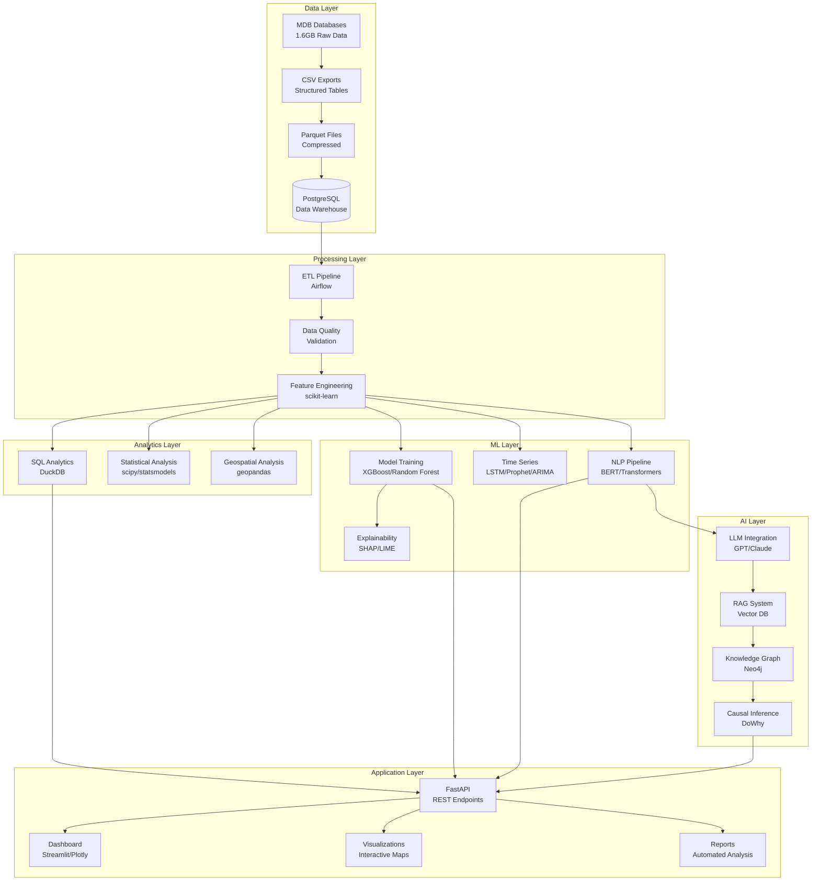

# PROJECT OVERVIEW

## Executive Summary

The **NTSB Aviation Accident Database Analysis** project transforms 60+ years of National Transportation Safety Board accident investigation data (1962-present, 1.6GB) into an advanced analytics platform. This project leverages cutting-edge machine learning, natural language processing, and AI techniques to extract actionable safety insights from historical accident data.

## Vision

Transform reactive accident investigation data into a proactive predictive safety intelligence system that:

- **Predicts accident severity** using ensemble ML models (XGBoost, Random Forest) with 90%+ accuracy
- **Identifies causal patterns** through AI-powered narrative analysis and knowledge graphs
- **Forecasts accident trends** using time series models (LSTM, Prophet, SARIMA)
- **Enables real-time risk assessment** via API-driven predictive analytics
- **Advances aviation safety research** through open-source tools and methodologies

## Project Status

**Current Version**: v1.0.1 (Production-ready foundation)

**Completed**:
- ✅ Three comprehensive databases (1962-2025, 1.6GB total)
- ✅ Complete extraction and analysis toolkit (Fish shell scripts)
- ✅ Production-ready Python examples with error handling
- ✅ Geospatial analysis with interactive maps
- ✅ Quick analysis workflows (100-30K events)
- ✅ Comprehensive documentation

**Planned**:
- 🔄 PostgreSQL migration for advanced analytics
- 🔄 Machine learning pipeline for severity prediction
- 🔄 NLP pipeline for narrative analysis
- 🔄 AI-powered causal inference system
- 🔄 Real-time API and dashboard

## Architecture Overview

## Technology Stack

### Core Data Processing
- **Databases**: PostgreSQL (warehouse), DuckDB (analytics), SQLite (local)
- **Data Formats**: MDB → CSV → Parquet (compression), HDF5 (large arrays)
- **ETL**: Apache Airflow (orchestration), Pandas/Polars (processing)
- **Languages**: Python 3.11+, Fish shell, SQL

### Machine Learning & Statistics
- **Classical ML**: scikit-learn, XGBoost, LightGBM, CatBoost
- **Deep Learning**: PyTorch, TensorFlow, Transformers (Hugging Face)
- **Time Series**: statsmodels (ARIMA/SARIMA), Prophet (Facebook), LSTM
- **Survival Analysis**: lifelines (Cox PH, Kaplan-Meier)
- **Explainability**: SHAP, LIME, ELI5

### Natural Language Processing
- **Frameworks**: spaCy, NLTK, Hugging Face Transformers
- **Models**: BERT, SafeAeroBERT (aviation-specific), RoBERTa
- **Techniques**: Named Entity Recognition, Topic Modeling (LDA), Sentiment Analysis
- **Vector Search**: FAISS, Chroma, Pinecone

### AI & Advanced Analytics
- **LLM Integration**: OpenAI API, Anthropic Claude, LangChain
- **RAG Systems**: LlamaIndex, Haystack
- **Knowledge Graphs**: Neo4j, NetworkX
- **Causal Inference**: DoWhy, CausalML

### Geospatial Analysis
- **Core**: geopandas, shapely, pyproj
- **Visualization**: folium (interactive maps), contextily (basemaps)
- **Clustering**: DBSCAN, HDBSCAN (hotspot detection)

### Visualization & Dashboards
- **Static**: matplotlib, seaborn
- **Interactive**: Plotly, Altair, Bokeh
- **Dashboards**: Streamlit, Dash, Voilà (Jupyter)
- **Maps**: folium, Kepler.gl, Deck.gl

### Deployment & Infrastructure
- **API**: FastAPI, Uvicorn, Pydantic
- **Containers**: Docker, Docker Compose
- **Orchestration**: Kubernetes (production scaling)
- **ML Ops**: MLflow (experiment tracking), DVC (data versioning)
- **Monitoring**: Prometheus, Grafana
- **CI/CD**: GitHub Actions, pre-commit hooks

## Data Assets

### Databases (1.6GB Total)

| Database | Period | Size | Status | Records |
|----------|--------|------|--------|---------|
| avall.mdb | 2008-Present | 537 MB | Updated monthly | ~30K events |
| Pre2008.mdb | 1982-2007 | 893 MB | Static snapshot | ~50K events |
| PRE1982.MDB | 1962-1981 | 188 MB | Static snapshot | ~20K events |

### Database Schema (Relational)

**Core Tables**:
- `events` - Master accident records (ev_id primary key)
- `aircraft` - Aircraft details (Aircraft_Key)
- `Flight_Crew` - Crew information and certifications
- `injury` - Injury severity and fatality counts
- `Findings` - Investigation findings (cm_inPC: probable cause flag)
- `Occurrences` - Event classification codes (100-430)
- `seq_of_events` - Timeline reconstruction
- `engines` - Powerplant specifications
- `narratives` - Unstructured accident descriptions

**Key Features**:
- 60+ years of continuous data
- Hierarchical coding system (100-93300 range)
- Geospatial coordinates (decimal degrees)
- Rich narrative text for NLP analysis
- Temporal sequences for causal analysis

## Use Cases & Applications

### 1. Predictive Safety Analytics
- **Accident severity classification** (Fatal/Serious/Minor/None)
- **Risk scoring** based on flight parameters
- **Real-time alerts** for high-risk operations
- **Component failure prediction** using survival analysis

### 2. Root Cause Analysis
- **Automated causal inference** from investigation reports
- **Human factors extraction** using NLP
- **Contributing factor identification** via knowledge graphs
- **Pattern recognition** across similar accidents

### 3. Trend Analysis & Forecasting
- **Time series prediction** of accident rates
- **Seasonal pattern detection** (weather, holidays)
- **Aircraft type risk profiling**
- **Geographic hotspot identification**

### 4. Regulatory Intelligence
- **Policy impact assessment** on safety metrics
- **Safety recommendation tracking**
- **Compliance monitoring**
- **Best practice identification**

### 5. Research & Academia
- **Safety factor correlation studies**
- **Human error taxonomy development**
- **Survival analysis methodologies**
- **Causal inference frameworks**

## Success Metrics

### Phase 1 (Foundation) - Q1 2025
- ✅ Database migration to PostgreSQL
- ✅ ETL pipeline operational
- ✅ Data quality framework (>95% clean data)
- ✅ Basic API endpoints functional

### Phase 2 (Analytics) - Q2 2025
- 📊 Statistical analysis suite complete
- 📊 Time series forecasting operational
- 📊 Geospatial clustering implemented
- 📊 Automated reporting system

### Phase 3 (Machine Learning) - Q3 2025
- 🤖 Severity prediction model (>85% accuracy)
- 🤖 Feature importance analysis with SHAP
- 🤖 Cross-validated ensemble models
- 🤖 Model serving infrastructure

### Phase 4 (AI Integration) - Q4 2025
- 🧠 NLP pipeline processing narratives
- 🧠 RAG system for investigation reports
- 🧠 Knowledge graph with 10K+ entities
- 🧠 LLM-powered causal inference

### Phase 5 (Production) - Q1 2026
- 🚀 Public API with rate limiting
- 🚀 Real-time dashboard (1M+ datapoints)
- 🚀 Automated monthly updates
- 🚀 Academic research partnerships

## Research Impact

**Academic Publications**: Target 3-5 peer-reviewed papers
**Open Source Contributions**: Public ML models and datasets
**Industry Partnerships**: Collaboration with aviation safety organizations
**Educational Resources**: Tutorials, notebooks, case studies

## Contact & Collaboration

**Repository**: [github.com/doublegate/NTSB-Dataset_Analysis](https://github.com/doublegate/NTSB-Dataset_Analysis)
**Documentation**: See `/docs` folder for detailed guides
**Issues**: GitHub issue tracker for bug reports and feature requests
**Contributing**: See CONTRIBUTING.md for contribution guidelines

## Next Steps

1. **Review Data Dictionary** - Understand schema and field definitions
2. **Explore Aviation Coding Lexicon** - Learn NTSB coding system
3. **Study Advanced Analytics Techniques** - Research methodologies
4. **Read Technical Implementation** - Understand architecture details
5. **Join Development** - Contribute to roadmap phases

---

**Version**: 1.0.0 (January 2025)
**Status**: Living Document - Updated with each major milestone
